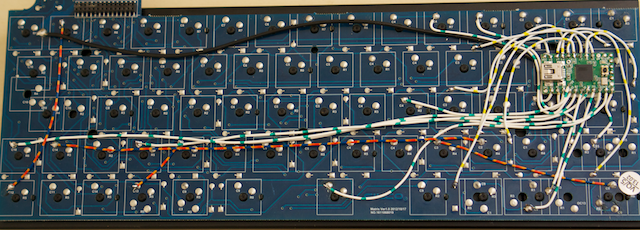

# ML67

---

**NOTE**: The current state of this project is unfinished but most of the documentation is included. I'm still filling in some holes, fixing some links and editing. Be aware that you may require to complete a little investigation yourself.

---

This project is an attempt to fully document the hardware of the [Filco Minila](https://www.diatec.co.jp/en/det.php?prod_c=1320) and describe how to hack the [tmk_keyboard](https://github.com/tmk/tmk_keyboard) firmware in. When you are finished, you should have a *fully programmable* keyboard that looks identical to the original Minila.

The [ML62](https://github.com/jonhiggs/ml62) was my first attempt. A very successful attempt in my opinion, but I came to discover to resolve some initial design decisions, I'd need to start over.

As I was going to start again, it made sense to properly document everything as I went. I also decided that for the project to be most useful, I should include some things that I personally didn't require. The ML67 will be that base project and the ML62 will become a fork with my own drastic customisations.

## The Design Criteria

- Work as a fully programmable keyboard.
- Continue to fit within original casing.
- Functional LEDs.
- Interface with the original USB connector.
- Functioning USB hub.

I have mostly succeeded in fulfilling my design criteria. The one exception is the functioning USB hub. I've been unable to solder to such a fine circuit.

## Tools and Stuff

- Filco Minila (I'm using Matrix Ver1.0 2012/10/17. I can't guarantee that anything else will work).
- Teensy 2
- Wire. Red, black and four other colours of your choice.
- Mini USB cable
- Soldering Iron
- Multimeter
- Wire Cutters
- Screwdrivers

To give you an idea on how long it should take I would expect that you should get it done in a weekend pretty easily. Just in case, I wouldn't count on it working on Monday morning. Have a spare keyboard.

Good luck in your own ML67 build.

## Table Of Contents

1. [Getting Started](./doc/01-getting_started.md)
2. [Deciphering the Circuit](./doc/02-circuit.md)
3. [Patching In](./doc/03-patching.md)
4. [TMK Firmware](./doc/04-tmk.md)
5. [LEDs](./doc/05-leds.md)
6. [USB Connector](./doc/06-usb_connector.md)
7. [Programming Button](./doc/07-programming_button.md)
