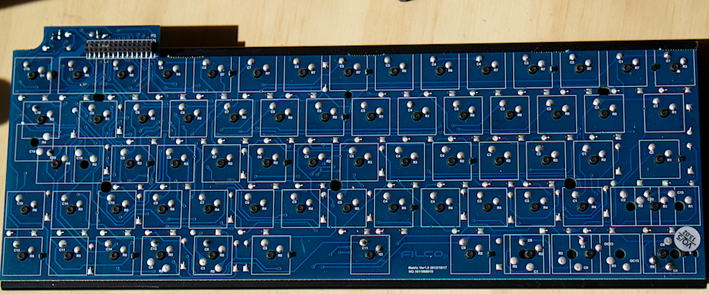

# Getting Started

Before you commit to anything, it's paramount that you can at least program your Teensy and it works. Preferably you'll also be able to compile the source as well.

## Programming The Teensy

Install the [Teensy Loader](https://www.pjrc.com/teensy/loader.html) for your operating system.

1. Program the ML76_standard.hex to your Teensy. (Hint: File -> Open HEX file)

2. Shorting B0 with F0 should press the letter 'Q'.

Don't proceed until you get this much working.

## Compiling for the Teensy

**TODO: Write this section.**  
For now, consult the internet. If you can't work it out, you won't be able to customise the firmware.

## Disassembly

First up, remove the screws from the bottom.

There will be a couple of tabs at the back. Pop the outside shell out with a small screwdriver, then pop out the front.

Remove the outside then pull the keyboard out. It will be connected to a small USB controller just via a 28pin connector. Be gentle and it should lift out.

At this point you should have a circuit board that looks like this.

Now we are ready to move on to deciphering the circuit.
