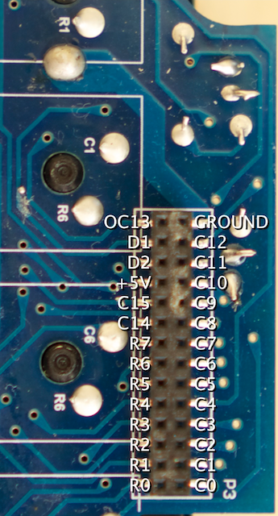
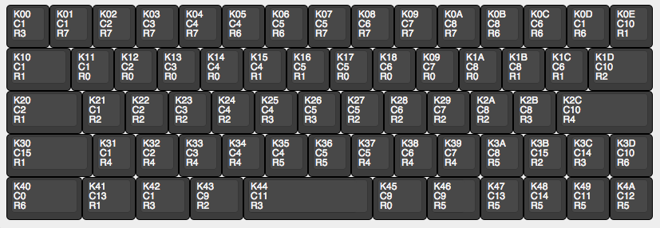
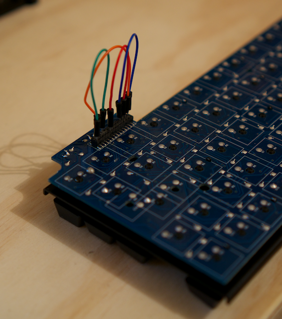

# Deciphering the Circuit

I'm going to cheat for now and just give you the answer. Perhaps you can reverse-engineer how I came to the answer if you are interested.

If you are not interested in how it works, you can safely move on to the next section. [Patching in](./patching)

*TODO:* Explain how to find the links.

The first thing we should do is decide upon what to name each of the keys. It doesn't really matter what they are called at this point, but to make things easier, I'm going to use the same naming scheme we will use later within the T.M.K. firmware.

Each key has three values. Top is the TMK identifier which we will use in the firmware later one. Middle is the column. Third is the row.

If you don't understand how a keyboard matrix works, I recommend you take a look at [this]().

|    | C0  | C1  | C2  | C3  | C4  | C5  | C6  | C7  | C8  | C9  | C10 | C11 | C12 | C13 | C14 | C15 |
|----|-----|-----|-----|-----|-----|-----|-----|-----|-----|-----|-----|-----|-----|-----|-----|-----|
| R0 |     | K11 | K12 | K13 | K14 | K17 | K18 | K19 | K1A | K45 |     |     |     |     |     |     |
| R1 |     | K10 | K20 |     | K15 | K16 | K1C |     | K1B |     | K0E |     |     | K41 |     | K30 |
| R2 |     | K21 | K22 | K23 | K24 | K27 | K28 | K29 | K2A | K43 | K1D | K44 |     |     |     | K3B |
| R3 |     | K00 |     |     | K25 | K26 |     |     | K2B | K42 |     |     |     |     | K3C |     |
| R4 |     | K31 | K32 | K33 | K34 | K37 | K38 | K39 |     |     | K2C |     |     |     |     |     |
| R5 |     |     |     |     | K35 | K36 |     |     | K3A | K46 |     | K49 | K4A | K47 | K48 |     |
| R6 | K40 | K0D |     |     | K05 | K06 | K0C |     | K0B |     | K3D |     |     |     |     |     |
| R7 |     | K01 | K02 | K03 | K04 | K07 | K08 | K09 | K0A |     |     |     |     |     |     |     |

## Merging Columns

Each row and each column will require a pin on your Teensy. It is possible to merge some columns together so that we can reduce the number of pins that we require.

|    | C1  | C2  | C3  | C4  | C5  | C6  | C7  | C8  | C9  | C10 | C11 | C15 |
|----|-----|-----|-----|-----|-----|-----|-----|-----|-----|-----|-----|-----|
| R0 | K11 | K12 | K13 | K14 | K17 | K18 | K19 | K1A | K45 |     |     |     |
| R1 | K10 | K20 |     | K15 | K16 | K1C | K41 | K1B |     | K0E |     | K30 |
| R2 | K21 | K22 | K23 | K24 | K27 | K28 | K29 | K2A | K43 | K1D | K44 | K3B |
| R3 | K00 | K3C |     | K25 | K26 |     |     | K2B | K42 |     |     |     |
| R4 | K31 | K32 | K33 | K34 | K37 | K38 | K39 |     |     | K2C |     |     |
| R5 | K4A | K48 |     | K35 | K36 |     | K47 | K3A | K46 |     | K49 |     |
| R6 | K0D |     | K40 | K05 | K06 | K0C |     | K0B |     | K3D |     |     |
| R7 | K01 | K02 | K03 | K04 | K07 | K08 | K09 | K0A |     |     |     |     |

C12 Merged onto C1
C14 Merged onto C2
C0  Merged into C3
C13 Merged onto C7

## Testing for Mistakes.

We really don't want to solder in mistakes. It'll be much easier to fix if we spot the errors earlier.

Use the original header to jump the columns we want to merge.

Grab your multimeter and make sure that all the merged columns are shorted correctly.

## connections

| Filco | Teensy |
|-------|--------|
| C1    | B0     |
| C2    | B1     |
| C3    | B2     |
| C4    | B3     |
| C5    | E6     |
| C6    | B7     |
| C7    | D0     |
| C8    | D1     |
| C9    | D2     |
| C10   | D3     |
| C11   | C6     |
| C15   | C7     |
| R0    | F0     |
| R1    | F1     |
| R2    | F4     |
| R3    | F5     |
| R4    | F6     |
| R5    | F7     |
| R6    | B6     |
| R7    | B5     |
| D2    | D5     |
| D1    | D4     |
| SPARE | B4     |
| SPARE | D7     |
| SPARE | D6     |

---

http://www.keyboard-layout-editor.com/##@@_c=#3c3c3c&t=#c5c5c5;&=K00%0AR3%0A%0A%0A%0A%0AC1&=K01%0AR7%0A%0A%0A%0A%0AC1&=K02%0AR7%0A%0A%0A%0A%0AC2&=K03%0AR7%0A%0A%0A%0A%0AC3&=K04%0AR7%0A%0A%0A%0A%0AC4&=K05%0AR6%0A%0A%0A%0A%0AC4&=K06%0AR6%0A%0A%0A%0A%0AC5&=K07%0AR7%0A%0A%0A%0A%0AC5&=K08%0AR7%0A%0A%0A%0A%0AC6&=K09%0AR7%0A%0A%0A%0A%0AC7&=K0A%0AR7%0A%0A%0A%0A%0AC8&=K0B%0AR6%0A%0A%0A%0A%0AC8&=K0C%0AR6%0A%0A%0A%0A%0AC6&=K0D%0AR6%0A%0A%0A%0A%0AC1&=K0E%0AR1%0A%0A%0A%0A%0AC10;&@_w:1.5;&=K10%0AR1%0A%0A%0A%0A%0AC1&=K11%0AR0%0A%0A%0A%0A%0AC1&=K12%0AR0%0A%0A%0A%0A%0AC2&=K13%0AR0%0A%0A%0A%0A%0AC3&=K14%0AR0%0A%0A%0A%0A%0AC4&=K15%0AR1%0A%0A%0A%0A%0AC4&=K16%0AR1%0A%0A%0A%0A%0AC5&=K17%0AR0%0A%0A%0A%0A%0AC5&=K18%0AR0%0A%0A%0A%0A%0AC6&=K19%0AR0%0A%0A%0A%0A%0AC7&=K1A%0AR0%0A%0A%0A%0A%0AC8&=K1B%0AR1%0A%0A%0A%0A%0AC8&=K1C%0AR1%0A%0A%0A%0A%0AC6&_w:1.5;&=K1D%0AR2%0A%0A%0A%0A%0AC10;&@_w:1.75;&=K20%0AR1%0A%0A%0A%0A%0AC2&=K21%0AR2%0A%0A%0A%0A%0AC1&=K22%0AR2%0A%0A%0A%0A%0AC2&=K23%0AR2%0A%0A%0A%0A%0AC3&=K24%0AR2%0A%0A%0A%0A%0AC4&=K25%0AR3%0A%0A%0A%0A%0AC4&=K26%0AR3%0A%0A%0A%0A%0AC5&=K27%0AR2%0A%0A%0A%0A%0AC5&=K28%0AR2%0A%0A%0A%0A%0AC6&=K29%0AR2%0A%0A%0A%0A%0AC7&=K2A%0AR2%0A%0A%0A%0A%0AC8&=K2B%0AR3%0A%0A%0A%0A%0AC8&_w:2.25;&=K2C%0AR4%0A%0A%0A%0A%0AC10;&@_w:2;&=K30%0AR1%0A%0A%0A%0A%0AC15&=K31%0AR4%0A%0A%0A%0A%0AC1&=K32%0AR4%0A%0A%0A%0A%0AC2&=K33%0AR4%0A%0A%0A%0A%0AC3&=K34%0AR4%0A%0A%0A%0A%0AC4&=K35%0AR5%0A%0A%0A%0A%0AC4&=K36%0AR5%0A%0A%0A%0A%0AC5&=K37%0AR4%0A%0A%0A%0A%0AC5&=K38%0AR4%0A%0A%0A%0A%0AC6&=K39%0AR4%0A%0A%0A%0A%0AC7&=K3A%0AR5%0A%0A%0A%0A%0AC8&=K3B%0AR2%0A%0A%0A%0A%0AC15&=K3C%0AR3%0A%0A%0A%0A%0AC14&=K3D%0AR6%0A%0A%0A%0A%0AC10;&@_w:1.75;&=K40%0AR6%0A%0A%0A%0A%0AC0&_w:1.25;&=K41%0AR1%0A%0A%0A%0A%0AC13&_w:1.25;&=K42%0AR3%0A%0A%0A%0A%0AC9&_w:1.25;&=K43%0AR2%0A%0A%0A%0A%0AC9&_w:2.75&w2:3;&=K44%0AR3%0A%0A%0A%0A%0AC11&_x:0.25&w:1.25;&=K45%0AR0%0A%0A%0A%0A%0AC9&_w2:1.25;&=K46%0AR5%0A%0A%0A%0A%0AC9&_x:0.25;&=K47%0AR5%0A%0A%0A%0A%0AC13&=K48%0AR5%0A%0A%0A%0A%0AC14&=K49%0AR5%0A%0A%0A%0A%0AC11&=K4A%0AR5%0A%0A%0A%0A%0AC12
