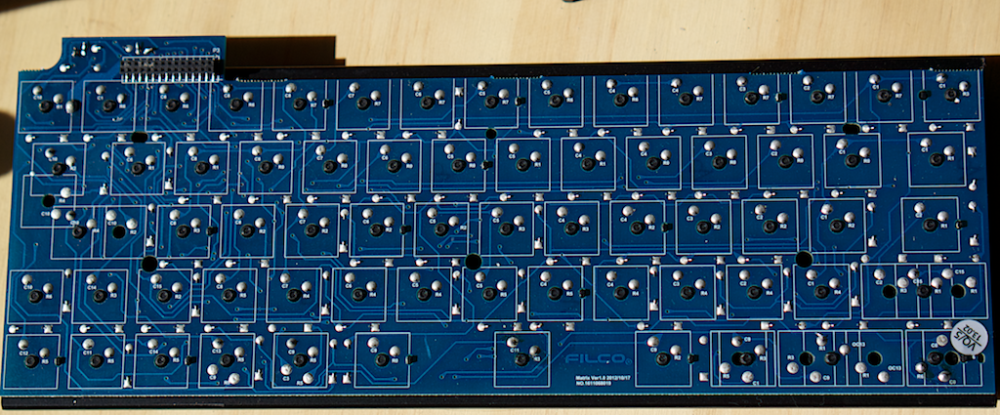
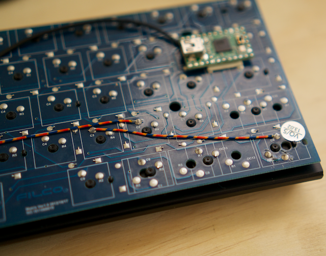
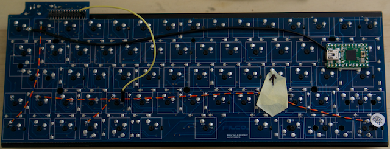
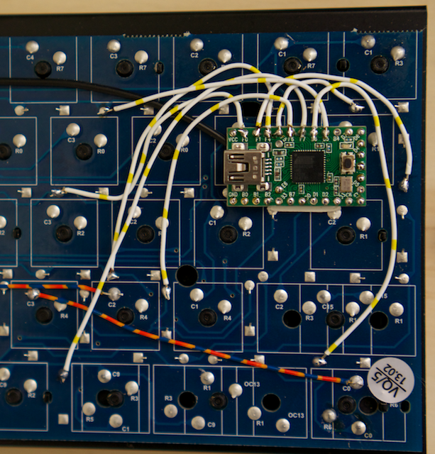
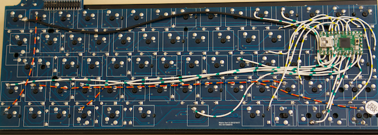

# 03. Patching In

It's time to start patching into the Minila board so break out the tools.

A few tips to keep in mind before you get started.

- If you are planing to use the original case, be careful not to obscure the holes that are drilled into the circuit board.

- Tin the pins on the Teensy before you start.

- You could use the original header for all this work. I was unable to find a connector to fit it though. If you find one, please let me know the product number.

## Disassembly

The first job is to pull apart your keyboard. Remove the screws from the bottom. There will be a couple of tabs at the back. Pop the outside shell out with a small screwdriver, then pop out the front.

Remove the plastic shroud and take the little caps off the LEDs. They will fall off and get lost very easily.

Lift the keyboard out. It will be connected to a small controller via a 28pin connector.

At this point you should have a circuit board that looks like this.

## Positioning the Teensy

We need to decide where we are going to put the Teensy. There are a couple of design considerations. 

- Can you fit a USB cable into the plug?
- Have you obscured any of the holes that the base uses to line up the board?
- Will it physically fit into the base with the added hight of the Teensy?
- Have you obscured the only point available for one of the pins? (unlikely regardless of where you use.)
- Are most of the points nearby so you're not running silly amounts of wire around?

The point I used was quite close to a hole in the board but it worked pretty good I thought.

I placed my Teensy on the Filco board with some double-sided tape. I've also grounded the Filco using the solder pad on the underside of the Teensy.

## Merging Columns

On the underside of the Filco board, we need to short the columns we decided to merge in the [last chapter](). It doesn't matter which points you use, it's up to you.

The columns that we will be joining are:  
`C12` -> `C1`  
`C14` -> `C2`  
`C0`  -> `C3`  
`C13` -> `C7`

There is nothing special. Just join them up like that.

## Rows

We'll do the rows before the columns because they are a bit trickier. We need to find a point to solder which is electrically equivalent to that of the original header. Specifically, there needs to be a diode between the switch and the Teensy. If you patch directly into the point marked `R` on the board, you will bypass the diode and cause yourself problems during simultaneous keystrokes.

The procedure I used to find the points to solder is:

1. Connect a jumper into the header for the pin you wish to find. (`R0` is the bottom-right pin. `R1` is to the left of that. `R2` is to the left of that, and so on until `R7`.)

2. Find a point on the board labelled the row you are looking for.

3. With your multimeter, check for continuity between the header pin and the solder points between the keys.

4. Once you have found one, check nearby for alternative points that may be better. You can sometimes follow the traces.

5. Mark with the corner of a piece of tape where you plan to solder to. It is otherwise very easy to accidentally solder to the wrong position.

6. Solder the other end to the Teensy.

The points to connect between the Filco and the Teensy are represented in the following table:

| Filco | Teensy |
|-------|--------|
| R0    | F0     |
| R1    | F1     |
| R2    | F4     |
| R3    | F5     |
| R4    | F6     |
| R5    | F7     |
| R6    | B6     |
| R7    | B5     |

Once finished, my circuit looked like this.

## Columns

Find any point on the board with the correct label, then solder it to the correct pin of the Teensy. Easy.

If the column has been merged, you can use either of the columns.

| Filco  | Teensy |
|--------|--------|
| C1/C12 | B0     |
| C2/C14 | B1     |
| C3/C0  | B2     |
| C4     | B3     |
| C5     | E6     |
| C6     | B7     |
| C7/C13 | D0     |
| C8     | D1     |
| C9     | D2     |
| C10    | D3     |
| C11    | C6     |
| C15    | C7     |

Once finished, my circuit looked like this.

## Reference

You can see the usage of all the Teensy pins in this table.

| Filco  | Teensy |
|--------|--------|
| C1/C12 | B0     |
| C2/C14 | B1     |
| C3/C0  | B2     |
| C4     | B3     |
| C5     | E6     |
| C6     | B7     |
| C7/C13 | D0     |
| C8     | D1     |
| C9     | D2     |
| C10    | D3     |
| C11    | C6     |
| C15    | C7     |
| R0     | F0     |
| R1     | F1     |
| R2     | F4     |
| R3     | F5     |
| R4     | F6     |
| R5     | F7     |
| R6     | B6     |
| R7     | B5     |
| D1     | D5     |
| SPARE  | D4     |
| SPARE  | B4     |
| SPARE  | D7     |
| SPARE  | D6     |

**[Next](./04-tmk.md)**
