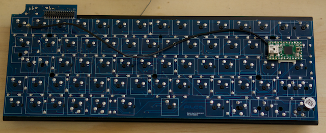

# Patching In

At this point, it's time to start patching into the Minila board so break out the soldering iron.

A few tips to keep in mind before you get started.

- If you are planing to use the original case, be careful not to obscure the holes that are drilled into the circuit board.

- Tin the pins on the Teensy before you start.

- You could use the original header for all this work. I was unable to find a connector to fit it though. If you find one, please let me know the product number.

## Positioning the Teensy

Before we do anything, we need to decide where we are going to put the Teensy. There are a couple of design considerations. The position of the USB connector, will it physically fit where you plan to put it, and can you get the USB cable into the plug once it's in place.

If you are planing on using the original case, you should remove the original controller It's not going to be any use and may get mighty confused or break. It should be possible to make something to line up the Teensy in the same position but then you'd want some sort of connector to join the two pieces. How you go about it is up to you.

In my design, I'm opting for the new keyboard to be a drop-in replacement for my [ML62](https://github.com/jonhiggs/ml62). I'm going to place my Teensy on the Filco board with some double-sided tape. I've also grounded the Filco using the solder pad on the underside of the Teensy.

## Merging Columns

On the underside of the Filco board, we need to short some of the columns together to reduce the number of pins that are required on the Teensy. For a better description as to why, see [chapter 2](./02-circuit). It doesn't matter which points you use, it's up to you.

The columns that we are joining are:  
`C12` -> `C1`  
`C14` -> `C2`  
`C0`  -> `C3`  
`C13` -> `C7`

There is nothing special. Just join them up like that.

## Rows

The rows are a bit trickier than the columns so we'll do those first. We need to find a point where we can solder which is electrically equivalent to that of the original header. Specifically, there needs to be a diode between the switch and the Teensy. If you patch directly into the point marked `R` on the board, you will bypass the diode and cause yourself problems during simultaneous keystrokes.

The procedure I used to find the points to solder is:

1. Connect a jumper into the header for the pin you wish to find. (`R0` is the bottom-right pin. `R1` is to the left of that. `R2` is to the left of that, and so on until `R7`.)
2. Find a point on the board labelled the row you are looking for.
3. With your multimeter, check for continuity between the header pin and the solder points between the keys.
4. Once you have found one, check nearby for alternative points that may be better. You can sometimes follow the traces.
5. Mark with the corner of a piece of tape where you plan to solder to. It is otherwise very easy to accidentally solder to the wrong position.
6. Solder the other end to the Teensy.

The points to connect between the Filco and the Teensy are represented in the following table:

| Filco | Teensy |
|-------|--------|
| R0    | F0     |
| R1    | F1     |
| R2    | F4     |
| R3    | F5     |
| R4    | F6     |
| R5    | F7     |
| R6    | B6     |
| R7    | B5     |

Once finished, my circuit looked like this.

## Columns

The process for the columns is easier than that of the rows. Find any point on the board with the correct label, then solder it to the correct pin of the Teensy.

For columns that have been merged, you can use either of the columns.

| Filco  | Teensy |
|--------|--------|
| C1/C12 | B0     |
| C2/C14 | B1     |
| C3/C0  | B2     |
| C4     | B3     |
| C5     | E6     |
| C6     | B7     |
| C7/C13 | D0     |
| C8     | D1     |
| C9     | D2     |
| C10    | D3     |
| C11    | C6     |
| C15    | C7     |

Once finished, my circuit looked like this.

## Reference

You can see the usage of all the Teensy pins in this table.

| Filco | Teensy |
|-------|--------|
| C1    | B0     |
| C2    | B1     |
| C3    | B2     |
| C4    | B3     |
| C5    | E6     |
| C6    | B7     |
| C7    | D0     |
| C8    | D1     |
| C9    | D2     |
| C10   | D3     |
| C11   | C6     |
| C15   | C7     |
| R0    | F0     |
| R1    | F1     |
| R2    | F4     |
| R3    | F5     |
| R4    | F6     |
| R5    | F7     |
| R6    | B6     |
| R7    | B5     |
| D1    | D5     |
| SPARE | D4     |
| SPARE | B4     |
| SPARE | D7     |
| SPARE | D6     |

