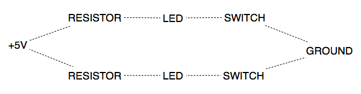
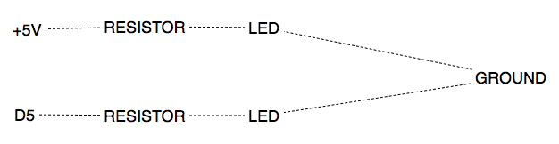
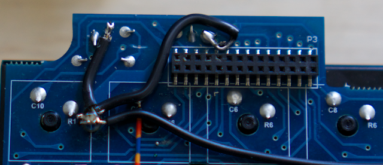
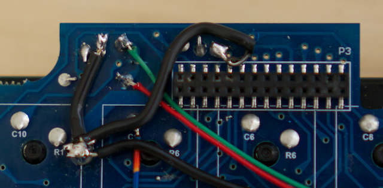
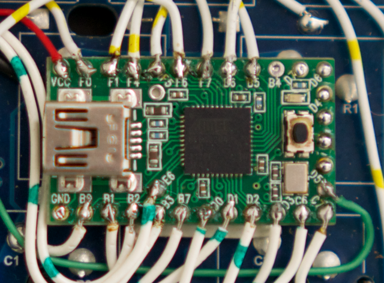

# LEDs

The original Filco LED circuit looks like this:

Because the original circuit has the switch on the ground, we need make some changes. 

1. Break the trace so that we can power each LED individually.
2. Ground the cathode legs that did go off to the switch (`D1` and `D2` on the original header).

The new circuit looks like this:

You can see where I have broken a trace. Either side of that break is where you can tap into each of the LEDs.

