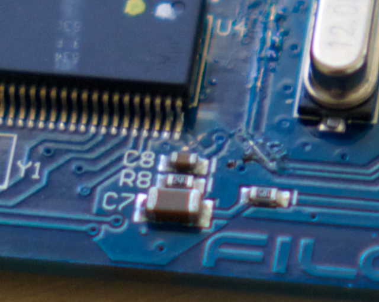
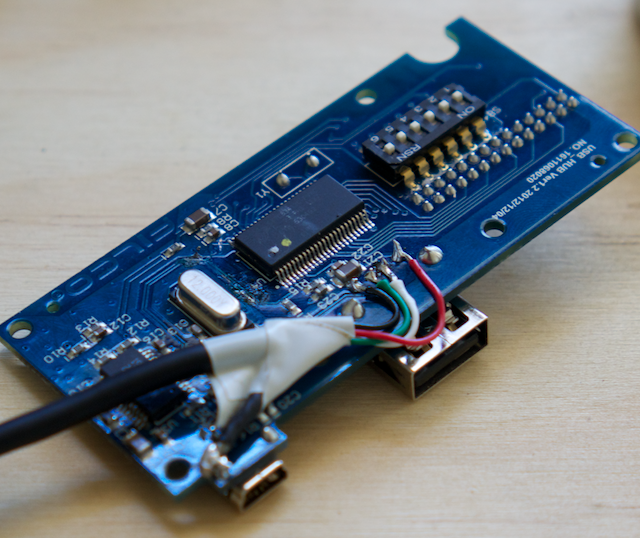
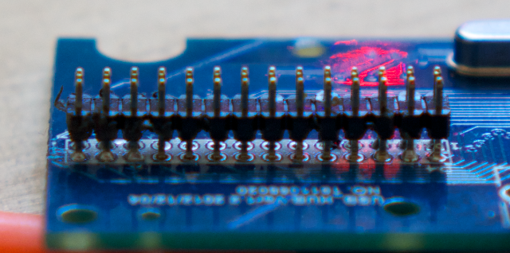
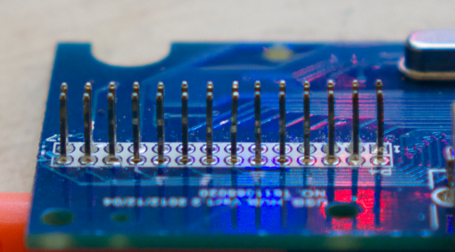
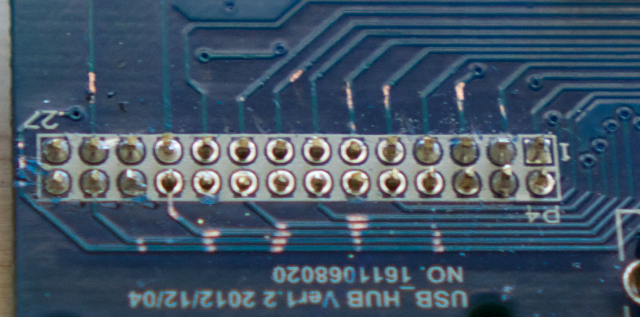
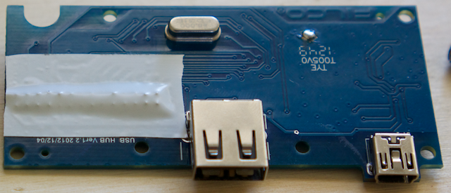
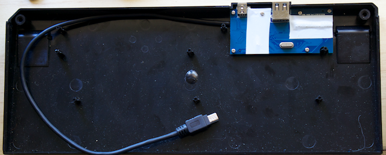
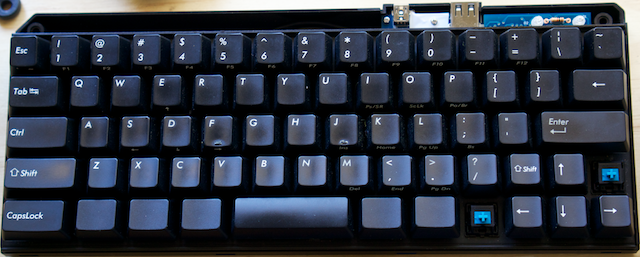
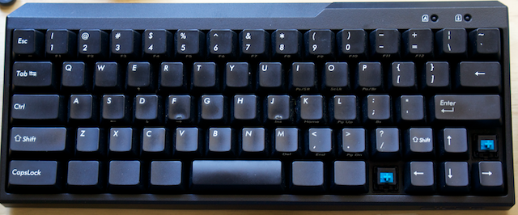

# 06. USB Connector

There are a few ways you can go about connecting your computer to your Teensy.

The most simple is to plug directly into the Teensy:

1. Drill a hole in you case.
2. Tie a knot in your lead so nothing gets yanked off.
3. Run cable out the hole and into your computer.

I'm not going to do that. I'm going to describe how to repurpose the original controller. **If you proceed, there is no going back. You're going to permanently cripple your controller!!!**

## How It Works

The original controller is quite simple. At least in it's most basic sense. There are two chips on the board. The lager one to the centre is a CY7C63413C microcontroller. The other one is a GL850G four port USB controller.

The microcontroller is responsible for turning the buttons into a keyboard. That is what is getting replaced by the Teensy.

The USB controller is really a four port USB hub. There is an input and two outputs used. One goes to the microcontroller, the other to the USB port.

## Disabling The Microcontroller

I first disabled the microcontroller by disconnecting it's power source. The bottom-right corner pin is it's VCC. After I scratched through the trace the keyboard was no longer seen by my computer. The circuit had effectively now become a USB hub with a single port.

## The USB Hub

The USB controller chip has three USB ports unused. One that goes to the USB port, and two that are just waiting to be tapped into. I believe it's possible to connect the Teensy to one of the untapped ports. Unfortunately I was unable to solder to it without shorting things out. It's a crazy small surface-mount thing. (If you manage, please let me know how you did it).

Instead I patched into the external USB port. Ideally, you'd remove the data pins from being externally accessible but I didn't do that. I'm not sure if I can without destroying it. Again, if you succeed please let me know how.

## Remove the Header

I removed the 28pin header so that strange things wouldn't happen. It may have been possible to leave it in and perhaps break a couple of traces, but I didn't try.

Start by removing the plastic spacer.

Chop the pins off close to the board.

Tape it up to avoid any shorts.

## Reassembly

I patched into the USB port.

Wrap it up in tape so nothing shorts the wrong things out or falls off when jostling it into the case. Then screw it back into place.

Put the keyboard in case.

Drop the LED covers back on then put the shroud on.

Screw it together and you're all done. :)

**[Next](./07-programming_button.md)**
